# Redis TCP Microservices Architecture

This project demonstrates a microservices architecture using Redis for communication between services through TCP protocol.

## Architecture Overview

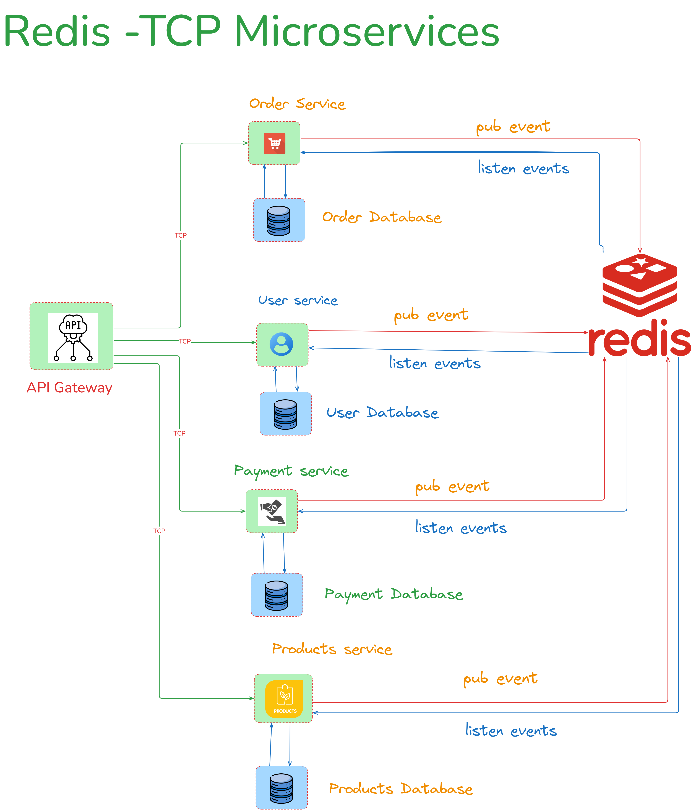

## Project Structure

The project is organized as a monorepo using Turborepo and consists of the following services:

- **API Gateway**: Acts as the entry point for clients, routing requests to appropriate microservices
- **Order Service**: Handles order creation and management
- **User Service**: Manages user data and authentication
- **Products Service**: Handles product inventory and information
- **Payment Service**: Processes payments and transactions

Each service communicates with the others using Redis as a message broker through TCP connections.

## Technologies Used

- NestJS - Microservices framework
- Redis - Message broker for inter-service communication
- TurboRepo - Monorepo management
- pnpm - Package management

## Getting Started

1. Install dependencies:

   ```
   pnpm install
   ```
2. Start Redis in docker (make sure Redis is installed):

   ```
    # install docker in your machine and pull the redis image
   docker pull redis:alpine
   # To run
   docker run --name redis-microservice-alpine -p 6379:6379 -d redis:alpine

   # Alpine with persistence
   docker run --name redis-alpine -p 6379:6379 -v redis-alpine-data:/data -d redis:alpine
   ```
3. Start all services:

   ```
   pnpm run dev
   ```
4. The API Gateway will be available at http://localhost:3000

# Turborepo starter

This Turborepo starter is maintained by the Turborepo core team.

## Using this example

Run the following command:

```sh
npx create-turbo@latest
```

```bash
pnpm add @nestjs/microservices
```

## To test Redis?

```
# Send execute the Redis-CLI
docker exec -it redis redis-cli
# Send a PING and expect PONG
PING 
# Add data to redis 
SET mykey "hello redis"
# get data
GET mykey 
```

## What's inside?

This Turborepo includes the following packages/apps:

### Apps and Packages

This Turborepo has the following apps and packages:

- `api-gateway`
- `payment-service`
- `orders-service`
- `product-service`
- `users-service`

Each package/app is 100% [TypeScript](https://www.typescriptlang.org/).

### Utilities

This Turborepo has some additional tools already setup for you:

- [TypeScript](https://www.typescriptlang.org/) for static type checking
- [ESLint](https://eslint.org/) for code linting
- [Prettier](https://prettier.io) for code formatting

### Build

To build all apps and packages, run the following command:

```
cd my-turborepo
pnpm build
```

### Develop

To develop all apps and packages, run the following command:

```
cd my-turborepo
pnpm dev
```

# Microservices Architecture with Redis and TCP

Based on your project's Redis TCP Microservices Architecture, I'll help you design entities, DTOs, database architecture, and API flow for each microservice.

## Database Architecture

For microservices, consider these database options:

### 1. Database Per Service Pattern

Each microservice should have its own dedicated database to maintain decoupling:

* **Order Service** : MongoDB or PostgreSQL (good for transaction records)
* **User Service** : PostgreSQL (for structured user data)
* **Products Service** : PostgreSQL or MongoDB (depending on how complex your product data is)
* **Payment Service** : PostgreSQL (good for financial transactions)

### 2. Entity Definitions

Let's define core entities for each service:

#### User Service Entities

```typescript
import { Column, Entity, PrimaryGeneratedColumn } from 'typeorm';

@Entity('users')
export class User {
  @PrimaryGeneratedColumn('uuid')
  id: string;

  @Column({ unique: true })
  email: string;

  @Column()
  password: string;

  @Column()
  firstName: string;

  @Column()
  lastName: string;

  @Column({ default: true })
  isActive: boolean;

  @Column({ default: 'user' })
  role: string;

  @Column({ type: 'timestamp', default: () => 'CURRENT_TIMESTAMP' })
  createdAt: Date;

  @Column({ type: 'timestamp', default: () => 'CURRENT_TIMESTAMP' })
  updatedAt: Date;
}
```

#### Product Service Entities

```typescript
import { Column, Entity, PrimaryGeneratedColumn } from 'typeorm';

@Entity('products')
export class Product {
  @PrimaryGeneratedColumn('uuid')
  id: string;

  @Column()
  name: string;

  @Column('text')
  description: string;

  @Column('decimal', { precision: 10, scale: 2 })
  price: number;

  @Column('int')
  stock: number;

  @Column({ default: true })
  isActive: boolean;

  @Column('simple-array', { nullable: true })
  categories: string[];

  @Column({ type: 'timestamp', default: () => 'CURRENT_TIMESTAMP' })
  createdAt: Date;

  @Column({ type: 'timestamp', default: () => 'CURRENT_TIMESTAMP' })
  updatedAt: Date;
}
```

#### Order Service Entities

```typescript
import { Column, Entity, PrimaryGeneratedColumn } from 'typeorm';

@Entity('orders')
export class Order {
  @PrimaryGeneratedColumn('uuid')
  id: string;

  @Column()
  userId: string;

  @Column('jsonb')
  items: OrderItem[];

  @Column('decimal', { precision: 10, scale: 2 })
  totalAmount: number;

  @Column({
    type: 'enum',
    enum: ['pending', 'processing', 'shipped', 'delivered', 'cancelled'],
    default: 'pending'
  })
  status: string;

  @Column({ nullable: true })
  paymentId: string;

  @Column({ type: 'timestamp', default: () => 'CURRENT_TIMESTAMP' })
  createdAt: Date;

  @Column({ type: 'timestamp', default: () => 'CURRENT_TIMESTAMP' })
  updatedAt: Date;
}

// This would be defined in a separate file
export interface OrderItem {
  productId: string;
  name: string;
  price: number;
  quantity: number;
}
```

#### Payment Service Entities

```typescript
import { Column, Entity, PrimaryGeneratedColumn } from 'typeorm';

@Entity('payments')
export class Payment {
  @PrimaryGeneratedColumn('uuid')
  id: string;

  @Column()
  orderId: string;

  @Column()
  userId: string;

  @Column('decimal', { precision: 10, scale: 2 })
  amount: number;

  @Column({
    type: 'enum',
    enum: ['pending', 'completed', 'failed', 'refunded'],
    default: 'pending'
  })
  status: string;

  @Column({ nullable: true })
  transactionId: string;

  @Column({
    type: 'enum',
    enum: ['credit_card', 'paypal', 'bank_transfer', 'crypto'],
    default: 'credit_card'
  })
  paymentMethod: string;

  @Column({ type: 'timestamp', default: () => 'CURRENT_TIMESTAMP' })
  createdAt: Date;

  @Column({ type: 'timestamp', default: () => 'CURRENT_TIMESTAMP' })
  updatedAt: Date;
}
```

## DTOs (Data Transfer Objects)

Let's define the DTOs for inter-service communication:

### User Service DTOs

```typescript
export class CreateUserDto {
  email: string;
  password: string;
  firstName: string;
  lastName: string;
}

export class UpdateUserDto {
  email?: string;
  firstName?: string;
  lastName?: string;
  isActive?: boolean;
}

export class UserDto {
  id: string;
  email: string;
  firstName: string;
  lastName: string;
  role: string;
  isActive: boolean;
  createdAt: Date;
}

export class ValidateUserDto {
  userId: string;
  email: string;
}
```

### Product Service DTOs

```typescript
export class CreateProductDto {
  name: string;
  description: string;
  price: number;
  stock: number;
  categories?: string[];
}

export class UpdateProductDto {
  name?: string;
  description?: string;
  price?: number;
  stock?: number;
  isActive?: boolean;
  categories?: string[];
}

export class ProductDto {
  id: string;
  name: string;
  description: string;
  price: number;
  stock: number;
  isActive: boolean;
  categories: string[];
}

export class CheckStockDto {
  productId: string;
  quantity: number;
}

export class UpdateStockDto {
  productId: string;
  quantity: number;
  operation: 'add' | 'subtract';
}
```

### Order Service DTOs

```typescript
export class OrderItemDto {
  productId: string;
  name: string;
  price: number;
  quantity: number;
}

export class CreateOrderDto {
  userId: string;
  items: OrderItemDto[];
}

export class UpdateOrderStatusDto {
  id: string;
  status: 'pending' | 'processing' | 'shipped' | 'delivered' | 'cancelled';
}

export class OrderDto {
  id: string;
  userId: string;
  items: OrderItemDto[];
  totalAmount: number;
  status: string;
  paymentId?: string;
  createdAt: Date;
}
```

### Payment Service DTOs

```typescript
export class ProcessPaymentDto {
  orderId: string;
  userId: string;
  amount: number;
  paymentMethod: 'credit_card' | 'paypal' | 'bank_transfer' | 'crypto';
  paymentDetails: any; // This would contain payment-specific data
}

export class PaymentResultDto {
  success: boolean;
  paymentId?: string;
  transactionId?: string;
  status: 'pending' | 'completed' | 'failed' | 'refunded';
  errorMessage?: string;
}
```

## Microservice Communication Setup

Here's how to implement the Redis TCP communication for your microservices:

### API Gateway Setup

```typescript
import { Module } from '@nestjs/common';
import { ClientsModule, Transport } from '@nestjs/microservices';

@Module({
  imports: [
    ClientsModule.register([
      {
        name: 'USER_SERVICE',
        transport: Transport.REDIS,
        options: {
          host: 'localhost',
          port: 6379,
        },
      },
      {
        name: 'PRODUCT_SERVICE',
        transport: Transport.REDIS,
        options: {
          host: 'localhost',
          port: 6379,
        },
      },
      {
        name: 'ORDER_SERVICE',
        transport: Transport.REDIS,
        options: {
          host: 'localhost',
          port: 6379,
        },
      },
      {
        name: 'PAYMENT_SERVICE',
        transport: Transport.REDIS,
        options: {
          host: 'localhost',
          port: 6379,
        },
      },
    ]),
    // Other imports...
  ],
  // Rest of module configuration...
})
export class AppModule {}
```

### Microservice Setup (Example for User Service)

```typescript
src/main.ts
import { NestFactory } from '@nestjs/core';
import { Transport, MicroserviceOptions } from '@nestjs/microservices';
import { AppModule } from './app.module';

async function bootstrap() {
  const app = await NestFactory.createMicroservice<MicroserviceOptions>(
    AppModule,
    {
      transport: Transport.REDIS,
      options: {
        host: 'localhost',
        port: 6379,
      },
    },
  );
  await app.listen();
}
bootstrap();
```

## API Flow Examples

### Example 1: Creating a new order

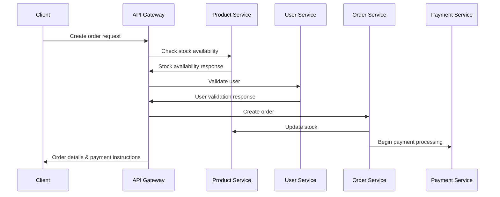

Here's a concrete implementation for this flow in the API Gateway:

```typescript
import { Controller, Post, Body, Inject } from '@nestjs/common';
import { ClientProxy } from '@nestjs/microservices';
import { firstValueFrom } from 'rxjs';
import { CreateOrderDto } from './dto/create-order.dto';

@Controller('orders')
export class OrdersController {
  constructor(
    @Inject('USER_SERVICE') private userClient: ClientProxy,
    @Inject('PRODUCT_SERVICE') private productClient: ClientProxy,
    @Inject('ORDER_SERVICE') private orderClient: ClientProxy,
  ) {}

  @Post()
  async createOrder(@Body() createOrderDto: CreateOrderDto) {
    // 1. Validate user
    const user = await firstValueFrom(
      this.userClient.send('validate_user', { userId: createOrderDto.userId })
    );
  
    if (!user) {
      throw new Error('User not found');
    }

    // 2. Check product stock for all items
    const stockChecks = await Promise.all(
      createOrderDto.items.map(item => 
        firstValueFrom(
          this.productClient.send('check_stock', { 
            productId: item.productId,
            quantity: item.quantity
          })
        )
      )
    );

    // If any stock check failed
    if (stockChecks.some(result => !result.available)) {
      throw new Error('Some products are out of stock');
    }

    // 3. Create order
    const order = await firstValueFrom(
      this.orderClient.send('create_order', createOrderDto)
    );

    return {
      message: 'Order created successfully',
      order
    };
  }
}
```

### Example 2: Processing a payment

```typescript
import { Controller } from '@nestjs/common';
import { MessagePattern, Payload, Ctx, RmqContext } from '@nestjs/microservices';
import { PaymentService } from './payment.service';
import { ProcessPaymentDto } from './dto/payment.dto';

@Controller()
export class PaymentController {
  constructor(private readonly paymentService: PaymentService) {}

  @MessagePattern('process_payment')
  async processPayment(
    @Payload() data: ProcessPaymentDto,
  ) {
    try {
      const result = await this.paymentService.processPayment(data);
  
      // If payment is successful, emit event for order service to update order status
      if (result.success) {
        // Using event pattern instead of direct communication
        return result;
      }
  
      return result;
    } catch (error) {
      return {
        success: false,
        status: 'failed',
        errorMessage: error.message,
      };
    }
  }
}
```

# E-commerce Microservices Additional Flows

## 1. User Authentication Flow

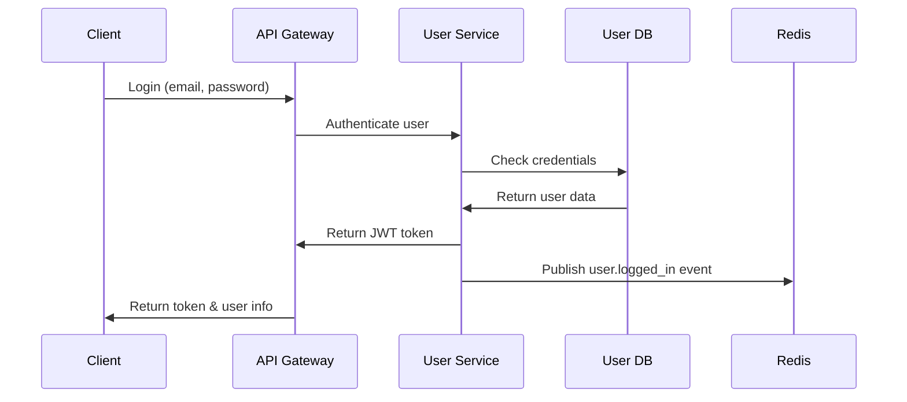

### Implementation:

```typescript
import { Controller, Post, Body, Inject } from '@nestjs/common';
import { ClientProxy } from '@nestjs/microservices';
import { firstValueFrom } from 'rxjs';
import { LoginDto } from './dto/login.dto';

@Controller('auth')
export class AuthController {
  constructor(
    @Inject('USER_SERVICE') private userClient: ClientProxy,
  ) {}

  @Post('login')
  async login(@Body() loginDto: LoginDto) {
    const result = await firstValueFrom(
      this.userClient.send('authenticate', loginDto)
    );
  
    if (!result.success) {
      throw new Error('Invalid credentials');
    }
  
    return result;
  }
}
```

## 2. Product Inventory Management Flow

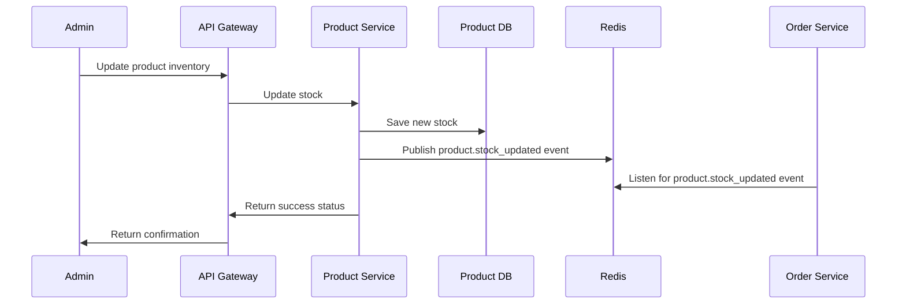

### Implementation:

```typescript
import { Controller } from '@nestjs/common';
import { MessagePattern, EventPattern, Payload } from '@nestjs/microservices';
import { ProductService } from './product.service';

@Controller()
export class ProductController {
  constructor(private readonly productService: ProductService) {}

  @MessagePattern('update_stock')
  async updateStock(@Payload() data: { productId: string; quantity: number; operation: 'add' | 'subtract' }) {
    const result = await this.productService.updateStock(data.productId, data.quantity, data.operation);
  
    // Publish event when stock is updated
    this.productService.publishStockUpdatedEvent({
      productId: data.productId,
      newStock: result.newStock,
      isLowStock: result.newStock < 10, // Example threshold
    });
  
    return result;
  }

  @EventPattern('order.created')
  async handleOrderCreated(data: any) {
    // Update product stock when order is created
    for (const item of data.items) {
      await this.productService.updateStock(
        item.productId,
        item.quantity,
        'subtract'
      );
    }
  }
}
```

## 3. Order Fulfillment Flow

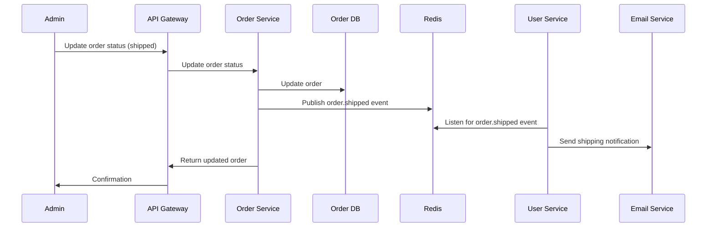

### Implementation:

```typescript
import { Controller } from '@nestjs/common';
import { MessagePattern, Payload, ClientProxy, Inject } from '@nestjs/microservices';
import { OrderService } from './order.service';
import { UpdateOrderStatusDto } from './dto/order.dto';

@Controller()
export class OrderController {
  constructor(
    private readonly orderService: OrderService,
    @Inject('NOTIFICATION_CLIENT') private notificationClient: ClientProxy
  ) {}

  @MessagePattern('update_order_status')
  async updateOrderStatus(@Payload() data: UpdateOrderStatusDto) {
    const updatedOrder = await this.orderService.updateOrderStatus(data.id, data.status);
  
    // Publish event for order status change
    this.notificationClient.emit('order.status_changed', {
      orderId: updatedOrder.id,
      userId: updatedOrder.userId,
      status: updatedOrder.status,
      updatedAt: new Date()
    });
  
    return updatedOrder;
  }
}
```

## 4. Product Search and Filtering Flow

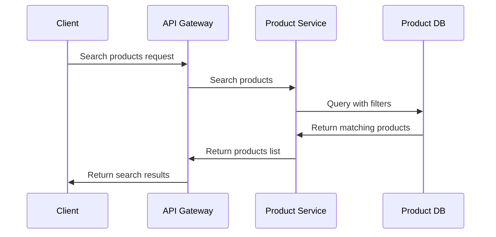

### Implementation:

```typescript
import { Controller, Get, Query, Inject } from '@nestjs/common';
import { ClientProxy } from '@nestjs/microservices';
import { firstValueFrom } from 'rxjs';

@Controller('products')
export class ProductsController {
  constructor(
    @Inject('PRODUCT_SERVICE') private productClient: ClientProxy,
  ) {}

  @Get('search')
  async searchProducts(
    @Query('query') query: string,
    @Query('category') category?: string,
    @Query('minPrice') minPrice?: number,
    @Query('maxPrice') maxPrice?: number,
    @Query('page') page = 1,
    @Query('limit') limit = 10,
  ) {
    const searchParams = {
      query,
      category,
      minPrice,
      maxPrice,
      pagination: { page, limit }
    };

    const result = await firstValueFrom(
      this.productClient.send('search_products', searchParams)
    );
  
    return result;
  }
}
```

## 5. Shopping Cart Management Flow

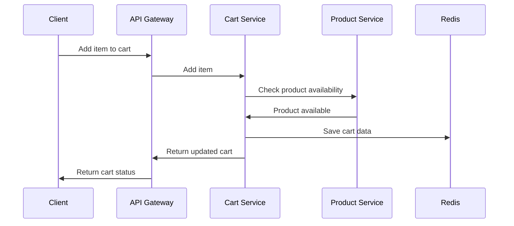

### Add Cart Service:

```typescript
import { Controller } from '@nestjs/common';
import { MessagePattern, Payload, Inject } from '@nestjs/microservices';
import { CartService } from './cart.service';
import { ClientProxy } from '@nestjs/microservices';
import { firstValueFrom } from 'rxjs';

@Controller()
export class CartController {
  constructor(
    private readonly cartService: CartService,
    @Inject('PRODUCT_SERVICE') private productClient: ClientProxy,
  ) {}

  @MessagePattern('add_to_cart')
  async addToCart(@Payload() data: { userId: string; productId: string; quantity: number }) {
    // Check if product is available
    const productAvailability = await firstValueFrom(
      this.productClient.send('check_stock', { 
        productId: data.productId, 
        quantity: data.quantity 
      })
    );
  
    if (!productAvailability.available) {
      return {
        success: false,
        message: 'Product is out of stock or not available in requested quantity',
      };
    }
  
    // Add to cart
    const cart = await this.cartService.addToCart(data.userId, data.productId, data.quantity);
  
    return {
      success: true,
      cart,
    };
  }
}
```

## 6. Order Cancellation Flow

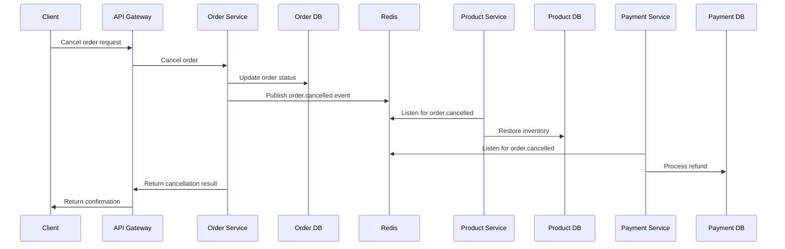

### Implementation:

```typescript
// Add to the existing OrderController

@MessagePattern('cancel_order')
async cancelOrder(@Payload() data: { orderId: string, userId: string, reason?: string }) {
  // Verify the order exists and belongs to the user
  const order = await this.orderService.findOne(data.orderId);
  
  if (!order || order.userId !== data.userId) {
    return {
      success: false,
      message: 'Order not found or does not belong to this user',
    };
  }
  
  // Check if order can be cancelled (not shipped yet)
  if (['shipped', 'delivered'].includes(order.status)) {
    return {
      success: false,
      message: 'Order cannot be cancelled in its current state',
    };
  }
  
  // Update order status
  const cancelledOrder = await this.orderService.updateOrderStatus(data.orderId, 'cancelled');
  
  // Emit event for order cancellation
  this.orderService.emit('order.cancelled', {
    orderId: data.orderId,
    userId: data.userId,
    items: order.items,
    reason: data.reason,
  });
  
  return {
    success: true,
    order: cancelledOrder,
  };
}
```

## 7. User Registration with Email Verification

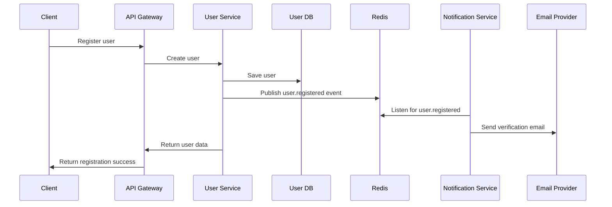

### Implementation:

```typescript
import { Controller } from '@nestjs/common';
import { MessagePattern, Payload } from '@nestjs/microservices';
import { UserService } from './user.service';
import { CreateUserDto } from './dto/user.dto';

@Controller()
export class UserController {
  constructor(private readonly userService: UserService) {}

  @MessagePattern('register_user')
  async register(@Payload() createUserDto: CreateUserDto) {
    // Create the user
    const user = await this.userService.create(createUserDto);
  
    // Generate verification token
    const verificationToken = await this.userService.generateVerificationToken(user.id);
  
    // Emit event for email verification
    this.userService.emit('user.registered', {
      userId: user.id,
      email: user.email,
      firstName: user.firstName,
      verificationToken,
    });
  
    return {
      success: true,
      user: {
        id: user.id,
        email: user.email,
        firstName: user.firstName,
        lastName: user.lastName,
        isActive: user.isActive,
      },
      message: 'User registered successfully. Please verify your email.',
    };
  }
}
```

## 8. Product Review and Rating System

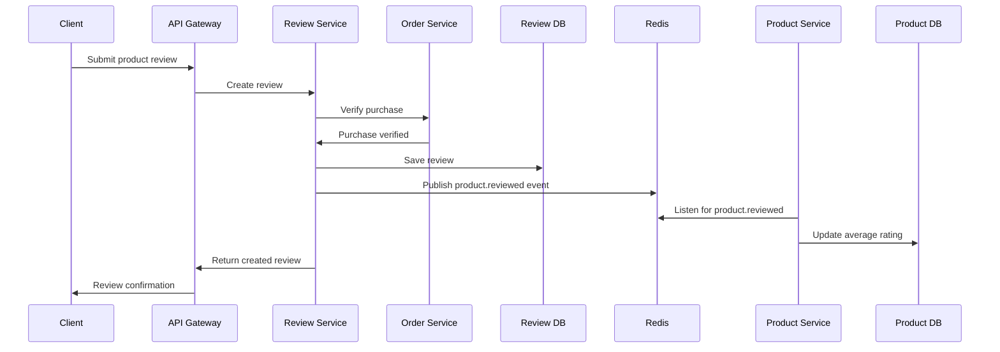

### Create Review Service:

```typescript
import { Controller } from '@nestjs/common';
import { MessagePattern, Payload, Inject } from '@nestjs/microservices';
import { ReviewService } from './review.service';
import { ClientProxy } from '@nestjs/microservices';
import { firstValueFrom } from 'rxjs';

@Controller()
export class ReviewController {
  constructor(
    private readonly reviewService: ReviewService,
    @Inject('ORDER_SERVICE') private orderClient: ClientProxy,
  ) {}

  @MessagePattern('create_review')
  async createReview(@Payload() data: { 
    userId: string; 
    productId: string; 
    rating: number; 
    comment: string;
  }) {
    // Verify user has purchased this product
    const hasPurchased = await firstValueFrom(
      this.orderClient.send('verify_purchase', { 
        userId: data.userId, 
        productId: data.productId 
      })
    );
  
    if (!hasPurchased.verified) {
      return {
        success: false,
        message: 'You can only review products you have purchased',
      };
    }
  
    // Create review
    const review = await this.reviewService.create(data);
  
    // Emit event for product review
    this.reviewService.emit('product.reviewed', {
      productId: data.productId,
      rating: data.rating,
      reviewId: review.id
    });
  
    return {
      success: true,
      review,
    };
  }
}
```

## 9. Wishlist Management

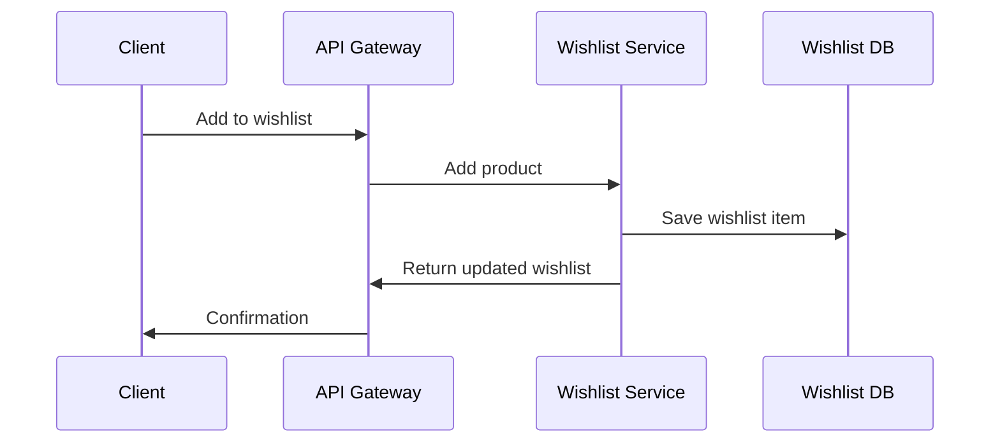

### Implement Wishlist Service:

```typescript
import { Controller } from '@nestjs/common';
import { MessagePattern, Payload } from '@nestjs/microservices';
import { WishlistService } from './wishlist.service';

@Controller()
export class WishlistController {
  constructor(private readonly wishlistService: WishlistService) {}

  @MessagePattern('add_to_wishlist')
  async addToWishlist(@Payload() data: { userId: string; productId: string }) {
    const wishlist = await this.wishlistService.addToWishlist(data.userId, data.productId);
  
    return {
      success: true,
      wishlist,
    };
  }

  @MessagePattern('get_wishlist')
  async getWishlist(@Payload() data: { userId: string }) {
    const wishlist = await this.wishlistService.getWishlistByUserId(data.userId);
  
    return {
      success: true,
      wishlist,
    };
  }

  @MessagePattern('remove_from_wishlist')
  async removeFromWishlist(@Payload() data: { userId: string; productId: string }) {
    const result = await this.wishlistService.removeFromWishlist(data.userId, data.productId);
  
    return {
      success: true,
      result,
    };
  }
}
```

## 10. Discount and Promo Code System

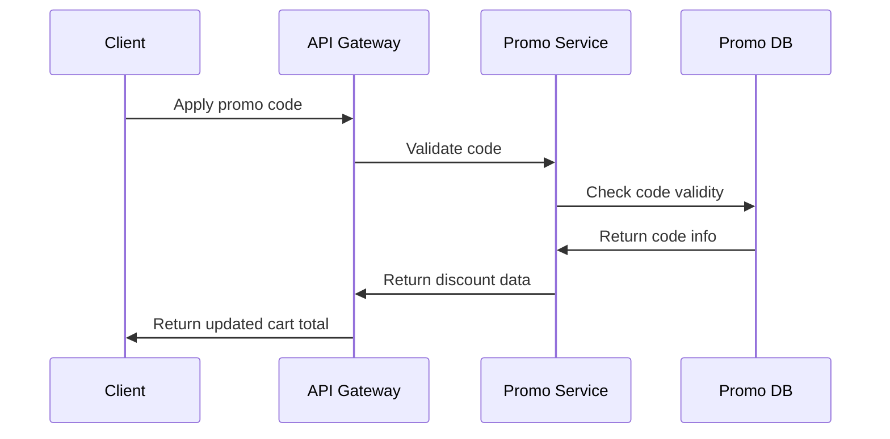

### Implement Promo Service:

```typescript
import { Controller } from '@nestjs/common';
import { MessagePattern, Payload } from '@nestjs/microservices';
import { PromoService } from './promo.service';

@Controller()
export class PromoController {
  constructor(private readonly promoService: PromoService) {}

  @MessagePattern('validate_promo')
  async validatePromo(@Payload() data: { 
    code: string; 
    userId: string; 
    cartTotal: number;
    products?: { id: string; quantity: number }[];
  }) {
    try {
      const promoResult = await this.promoService.validateAndApply(
        data.code,
        data.userId,
        data.cartTotal,
        data.products,
      );
  
      return {
        success: true,
        valid: promoResult.valid,
        discountAmount: promoResult.discountAmount,
        discountedTotal: promoResult.discountedTotal,
        message: promoResult.message,
      };
    } catch (error) {
      return {
        success: false,
        valid: false,
        message: error.message,
      };
    }
  }
}
```

## 11. Notification System (Email, SMS, Push)

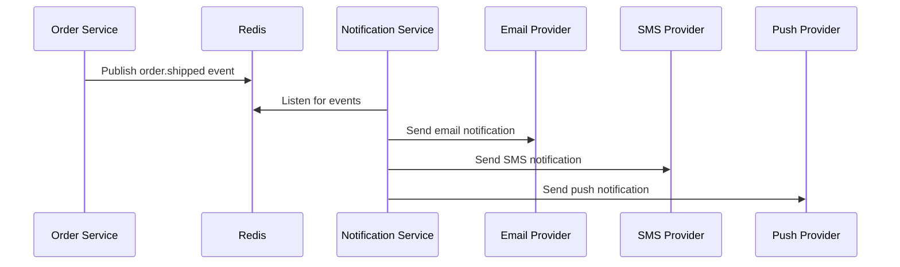

### Implement Notification Service:

```typescript
import { Controller } from '@nestjs/common';
import { EventPattern, Payload } from '@nestjs/microservices';
import { NotificationService } from './notification.service';

@Controller()
export class NotificationController {
  constructor(private readonly notificationService: NotificationService) {}

  @EventPattern('order.created')
  async handleOrderCreated(@Payload() data: any) {
    await this.notificationService.sendOrderConfirmation(
      data.userId,
      data.orderId,
      data.totalAmount
    );
  }

  @EventPattern('order.shipped')
  async handleOrderShipped(@Payload() data: any) {
    await this.notificationService.sendShippingNotification(
      data.userId,
      data.orderId,
      data.trackingInfo
    );
  }

  @EventPattern('user.registered')
  async handleUserRegistered(@Payload() data: any) {
    await this.notificationService.sendVerificationEmail(
      data.email,
      data.firstName,
      data.verificationToken
    );
  }
}
```

## 12. Analytics Service for Business Intelligence

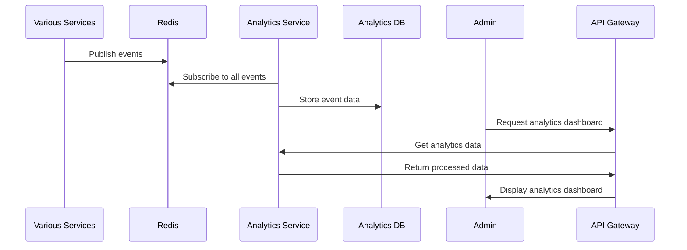

### Implement Analytics Service:

```typescript
import { Controller } from '@nestjs/common';
import { EventPattern, MessagePattern, Payload } from '@nestjs/microservices';
import { AnalyticsService } from './analytics.service';

@Controller()
export class AnalyticsController {
  constructor(private readonly analyticsService: AnalyticsService) {}

  @EventPattern('order.created')
  async trackOrderCreated(@Payload() data: any) {
    await this.analyticsService.trackOrder(data);
  }

  @EventPattern('user.registered')
  async trackUserRegistered(@Payload() data: any) {
    await this.analyticsService.trackUser(data);
  }

  @EventPattern('product.viewed')
  async trackProductViewed(@Payload() data: any) {
    await this.analyticsService.trackProductView(data);
  }

  @MessagePattern('get_sales_analytics')
  async getSalesAnalytics(@Payload() data: { 
    startDate: string; 
    endDate: string;
    groupBy: 'day' | 'week' | 'month';
  }) {
    return this.analyticsService.getSalesAnalytics(
      new Date(data.startDate),
      new Date(data.endDate),
      data.groupBy
    );
  }
}
```
