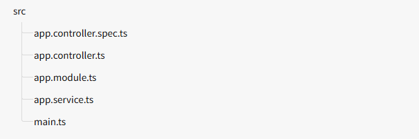
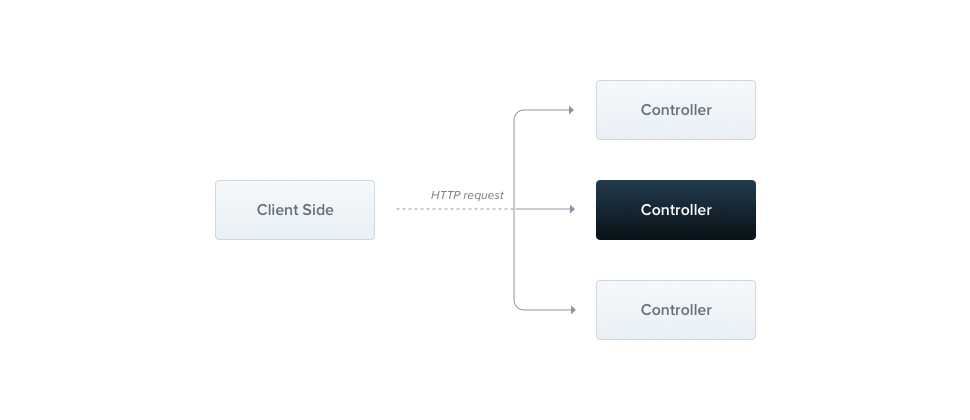

# Nest.js

Nest (NestJS) is a framework for building efficient, scalable [Node.js](https://nodejs.org/) server-side applications. It uses progressive JavaScript, is built with and fully supports [TypeScript](http://www.typescriptlang.org/) (yet still enables developers to code in pure JavaScript) and combines elements of

* OOP (Object Oriented Programming)
* FP (Functional Programming)
* FRP (Functional Reactive Programming).

Under the hood, Nest makes use of robust HTTP Server frameworks like [Express](https://expressjs.com/) (the default) and optionally can be configured to use [Fastify](https://github.com/fastify/fastify) as well!

## Getting Started

#### Installation

To get started, you can either scaffold the project with the [Nest CLI](https://docs.nestjs.com/cli/overview), or [clone a starter project](https://docs.nestjs.com/#alternatives) (both will produce the same outcome).

To scaffold the project with the Nest CLI, run the following commands. This will create a new project directory, and populate the directory with the initial core Nest files and supporting modules, creating a conventional base structure for your project. Creating a new project with the **Nest CLI** is recommended for first-time users. We'll continue with this approach in [First Steps](https://docs.nestjs.com/first-steps).

```bash

$ npm i -g @nestjs/cli
$ nest new project-name
```

#### Project Structure

The `project-name` directory will be created, node modules and a few other boilerplate files will be installed, and a `src/` directory will be created and populated with several core files.



Here's a brief overview of those core files:

| `app.controller.ts`      | A basic controller with a single route.                                                                               |
| -------------------------- | --------------------------------------------------------------------------------------------------------------------- |
| `app.controller.spec.ts` | The unit tests for the controller.                                                                                    |
| `app.module.ts`          | The root module of the application.                                                                                   |
| `app.service.ts`         | A basic service with a single method.                                                                                 |
| `main.ts`                | The entry file of the application which uses the core function `NestFactory` to create a Nest application instance. |

The `main.ts` includes an async function, which will **bootstrap** our application:

```typescript

import { NestFactory } from '@nestjs/core';
import { AppModule } from './app.module';

async function bootstrap() {
  const app = await NestFactory.create(AppModule);
  await app.listen(process.env.PORT ?? 3000);
}
bootstrap();

```

#### Platform

Nest aims to be a platform-agnostic framework. Platform independence makes it possible to create reusable logical parts that developers can take advantage of across several different types of applications. Technically, Nest is able to work with any Node HTTP framework once an adapter is created. There are two HTTP platforms supported out-of-the-box: [express](https://expressjs.com/) and [fastify](https://www.fastify.io/). You can choose the one that best suits your needs.

| platform-express           | [Express](https://expressjs.com/) is a well-known minimalist web framework for node. It's a battle tested, production-ready library with lots of resources implemented by the community. The `@nestjs/platform-express` package is used by default. Many users are well served with Express, and need take no action to enable it. |
| -------------------------- | --------------------------------------------------------------------------------------------------------------------------------------------------------------------------------------------------------------------------------------------------------------------------------------------------------------------------------- |
| **platform-fastify** | [Fastify](https://www.fastify.io/) is a high performance and low overhead framework highly focused on providing maximum efficiency and speed. Read how to use it [here](https://docs.nestjs.com/techniques/performance).                                                                                                                |

#### Running the application[#](https://docs.nestjs.com/first-steps#running-the-application)

Once the installation process is complete, you can run the following command at your OS command prompt to start the application listening for inbound HTTP requests:

```bash
pnpm run start
```

or

```
npm run start
```

#### Linting and formatting[#](https://docs.nestjs.com/first-steps#linting-and-formatting)

[CLI](https://docs.nestjs.com/cli/overview) provides best effort to scaffold a reliable development workflow at scale. Thus, a generated Nest project comes with both a code **linter** and **formatter** preinstalled (respectively [eslint](https://eslint.org/) and [prettier](https://prettier.io/)).

> **Hint**Not sure about the role of formatters vs linters? Learn the difference [here](https://prettier.io/docs/en/comparison.html).

To ensure maximum stability and extensibility, we use the base [`eslint`](https://www.npmjs.com/package/eslint) and [`prettier`](https://www.npmjs.com/package/prettier) cli packages. This setup allows neat IDE integration with official extensions by design.

For headless environments where an IDE is not relevant (Continuous Integration, Git hooks, etc.) a Nest project comes with ready-to-use `npm` scripts.

```bash

# Lint and autofix with eslint
$ npm run lint

# Format with prettier
$ npm run format
```

## Controllers

Controllers are responsible for handling incoming **requests** and sending **responses** back to the client.




A controller's purpose is to handle specific requests for the application. The **routing** mechanism determines which controller will handle each request. Often, a controller has multiple routes, and each route can perform a different action.

To create a basic controller, we use classes and  **decorators** . Decorators link classes with the necessary metadata, allowing Nest to create a routing map that connects requests to their corresponding controllers.


#### Routing

In the following example, we’ll use the `@Controller()` decorator, which is **required** to define a basic controller. We'll specify an optional route path prefix of `cats`. Using a path prefix in the `@Controller()` decorator helps us group related routes together and reduces repetitive code. For example, if we want to group routes that manage interactions with a cat entity under the `/cats` path, we can specify the `cats` path prefix in the `@Controller()` decorator. This way, we don't need to repeat that portion of the path for each route in the file.

content_copy**cats.controller.ts****JS**

```typescript

import { Controller, Get } from '@nestjs/common';

@Controller('cats')
export class CatsController {
  @Get()
  findAll(): string {
    return 'This action returns all cats';
  }
}
```

> **Hint🤔** To create a controller using the CLI, simply execute the `nest g controller [name]` command.
