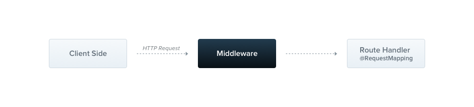

### Middleware

Middleware is a function which is called **before** the route handler. Middleware functions have access to the [request](https://expressjs.com/en/4x/api.html#req) and [response](https://expressjs.com/en/4x/api.html#res) objects, and the `next()` middleware function in the application’s request-response cycle. The **next** middleware function is commonly denoted by a variable named `next`.



Nest middleware are, by default, equivalent to [express](https://expressjs.com/en/guide/using-middleware.html) middleware. The following description from the official express documentation describes the capabilities of middleware:

> Middleware functions can perform the following tasks:* execute any code.
>
> * make changes to the request and the response objects.
> * end the request-response cycle.
> * call the next middleware function in the stack.
> * if the current middleware function does not end the request-response cycle, it must call `next()` to pass control to the next middleware function. Otherwise, the request will be left hanging.

You implement custom Nest middleware in either a function, or in a class with an `@Injectable()` decorator. The class should implement the `NestMiddleware` interface, while the function does not have any special requirements. Let's start by implementing a simple middleware feature using the class method.

**logger.middleware.ts**

```typescript

import { Injectable, NestMiddleware } from '@nestjs/common';
import { Request, Response, NextFunction } from 'express';

@Injectable()
export class LoggerMiddleware implements NestMiddleware {
  use(req: Request, res: Response, next: NextFunction) {
    console.log('Request...');
    next();
  }
}
```

#### Dependency injection

Nest middleware fully supports Dependency Injection. Just as with providers and controllers, they are able to **inject dependencies** that are available within the same module. As usual, this is done through the `constructor`.

#### Applying middleware

There is no place for middleware in the `@Module()` decorator. Instead, we set them up using the `configure()` method of the module class. Modules that include middleware have to implement the `NestModule` interface. Let's set up the `LoggerMiddleware` at the `AppModule` level.

**app.module.ts**

```typescript

import { Module, NestModule, MiddlewareConsumer } from '@nestjs/common';
import { LoggerMiddleware } from './common/middleware/logger.middleware';
import { CatsModule } from './cats/cats.module';

@Module({
  imports: [CatsModule],
})
export class AppModule implements NestModule {
  configure(consumer: MiddlewareConsumer) {
    consumer
      .apply(LoggerMiddleware)
      .forRoutes('cats');
  }
}
```

In the above example we have set up the `LoggerMiddleware` for the `/cats` route handlers that were previously defined inside the `CatsController`. We may also further restrict a middleware to a particular request method by passing an object containing the route `path` and request `method` to the `forRoutes()` method when configuring the middleware. In the example below, notice that we import the `RequestMethod` enum to reference the desired request method type.

**app.module.ts**

```typescript

import { Module, NestModule, RequestMethod, MiddlewareConsumer } from '@nestjs/common';
import { LoggerMiddleware } from './common/middleware/logger.middleware';
import { CatsModule } from './cats/cats.module';

@Module({
  imports: [CatsModule],
})
export class AppModule implements NestModule {
  configure(consumer: MiddlewareConsumer) {
    consumer
      .apply(LoggerMiddleware)
      .forRoutes({ path: 'cats', method: RequestMethod.GET });
  }
}
```

> **Hint**The `configure()` method can be made asynchronous using `async/await` (e.g., you can `await` completion of an asynchronous operation inside the `configure()` method body).

> **Warning**When using the `express` adapter, the NestJS app will register `json` and `urlencoded` from the package `body-parser` by default. This means if you want to customize that middleware via the `MiddlewareConsumer`, you need to turn off the global middleware by setting the `bodyParser` flag to `false` when creating the application with `NestFactory.create()`.

#### Middleware consumer

The `MiddlewareConsumer` is a helper class. It provides several built-in methods to manage middleware. All of them can be simply **chained** in the [fluent style](https://en.wikipedia.org/wiki/Fluent_interface). The `forRoutes()` method can take a single string, multiple strings, a `RouteInfo` object, a controller class and even multiple controller classes. In most cases you'll probably just pass a list of **controllers** separated by commas. Below is an example with a single controller:

**app.module.ts**

```typescript

import { Module, NestModule, MiddlewareConsumer } from '@nestjs/common';
import { LoggerMiddleware } from './common/middleware/logger.middleware';
import { CatsModule } from './cats/cats.module';
import { CatsController } from './cats/cats.controller';

@Module({
  imports: [CatsModule],
})
export class AppModule implements NestModule {
  configure(consumer: MiddlewareConsumer) {
    consumer
      .apply(LoggerMiddleware)
      .forRoutes(CatsController);
  }
}
```

> **Hint**The `apply()` method may either take a single middleware, or multiple arguments to specify [multiple middlewares](https://docs.nestjs.com/middleware#multiple-middleware).

#### Functional middleware

The `LoggerMiddleware` class we've been using is quite simple. It has no members, no additional methods, and no dependencies. Why can't we just define it in a simple function instead of a class? In fact, we can. This type of middleware is called  **functional middleware** . Let's transform the logger middleware from class-based into functional middleware to illustrate the difference:

**logger.middleware.ts**

```typescript

import { Request, Response, NextFunction } from 'express';

export function logger(req: Request, res: Response, next: NextFunction) {
  console.log(`Request...`);
  next();
};
```

And use it within the `AppModule`:

**app.module.ts**

```typescript

consumer
  .apply(logger)
  .forRoutes(CatsController);
```

> **Hint**Consider using the simpler **functional middleware** alternative any time your middleware doesn't need any dependencies.

#### Multiple middleware

As mentioned above, in order to bind multiple middleware that are executed sequentially, simply provide a comma separated list inside the `apply()` method:

```typescript

consumer.apply(cors(), helmet(), logger).forRoutes(CatsController);
```

#### Global middleware

If we want to bind middleware to every registered route at once, we can use the `use()` method that is supplied by the `INestApplication` instance:

**main.ts**

```typescript

const app = await NestFactory.create(AppModule);
app.use(logger);
await app.listen(process.env.PORT ?? 3000);
```

> **Hint**Accessing the DI container in a global middleware is not possible. You can use a [functional middleware](https://docs.nestjs.com/middleware#functional-middleware) instead when using `app.use()`. Alternatively, you can use a class middleware and consume it with `.forRoutes('*')` within the `AppModule` (or any other module).
