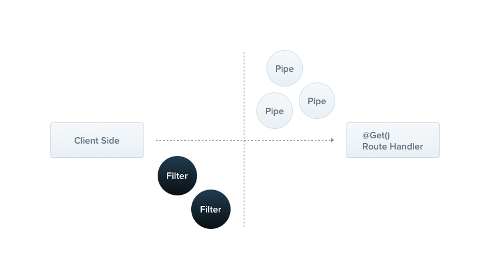

### Exception filters

Nest comes with a built-in **exceptions layer** which is responsible for processing all unhandled exceptions across an application. When an exception is not handled by your application code, it is caught by this layer, which then automatically sends an appropriate user-friendly response.



Out of the box, this action is performed by a built-in  **global exception filter** , which handles exceptions of type `HttpException` (and subclasses of it). When an exception is **unrecognized** (is neither `HttpException` nor a class that inherits from `HttpException`), the built-in exception filter generates the following default JSON response:


```json

{
  "statusCode": 500,
  "message": "Internal server error"
}
```


> **Hint** The global exception filter partially supports the `http-errors` library. Basically, any thrown exception containing the `statusCode` and `message` properties will be properly populated and sent back as a response (instead of the default `InternalServerErrorException` for unrecognized exceptions).

#### Throwing standard exceptions

Nest provides a built-in `HttpException` class, exposed from the `@nestjs/common` package. For typical HTTP REST/GraphQL API based applications, it's best practice to send standard HTTP response objects when certain error conditions occur.

For example, in the `CatsController`, we have a `findAll()` method (a `GET` route handler). Let's assume that this route handler throws an exception for some reason. To demonstrate this, we'll hard-code it as follows:

**cats.controller.ts**

```typescript

@Get()
async findAll() {
  throw new HttpException('Forbidden', HttpStatus.FORBIDDEN);
}
```

> **Hint** We used the `HttpStatus` here. This is a helper enum imported from the `@nestjs/common` package.

When the client calls this endpoint, the response looks like this:

```json

{
  "statusCode": 403,
  "message": "Forbidden"
}
```

The `HttpException` constructor takes two required arguments which determine the response:

* The `response` argument defines the JSON response body. It can be a `string` or an `object` as described below.
* The `status` argument defines the [HTTP status code](https://developer.mozilla.org/en-US/docs/Web/HTTP/Status).

By default, the JSON response body contains two properties:

* `statusCode`: defaults to the HTTP status code provided in the `status` argument
* `message`: a short description of the HTTP error based on the `status`

To override just the message portion of the JSON response body, supply a string in the `response` argument. To override the entire JSON response body, pass an object in the `response` argument. Nest will serialize the object and return it as the JSON response body.

The second constructor argument - `status` - should be a valid HTTP status code. Best practice is to use the `HttpStatus` enum imported from `@nestjs/common`.

There is a **third** constructor argument (optional) - `options` - that can be used to provide an error [cause](https://nodejs.org/en/blog/release/v16.9.0/#error-cause). This `cause` object is not serialized into the response object, but it can be useful for logging purposes, providing valuable information about the inner error that caused the `HttpException` to be thrown.

Here's an example overriding the entire response body and providing an error cause:

**cats.controller.ts**

```typescript

@Get()
async findAll() {
  try {
    await this.service.findAll()
  } catch (error) {
    throw new HttpException({
      status: HttpStatus.FORBIDDEN,
      error: 'This is a custom message',
    }, HttpStatus.FORBIDDEN, {
      cause: error
    });
  }
}
```

Using the above, this is how the response would look:

```json

{
  "status": 403,
  "error": "This is a custom message"
}
```

#### Exceptions logging

By default, the exception filter does not log built-in exceptions like `HttpException` (and any exceptions that inherit from it). When these exceptions are thrown, they won't appear in the console, as they are treated as part of the normal application flow. The same behavior applies to other built-in exceptions such as `WsException` and `RpcException`.

These exceptions all inherit from the base `IntrinsicException` class, which is exported from the `@nestjs/common` package. This class helps differentiate between exceptions that are part of normal application operation and those that are not.

If you want to log these exceptions, you can create a custom exception filter. We'll explain how to do this in the next section.

#### Custom exceptions

In many cases, you will not need to write custom exceptions, and can use the built-in Nest HTTP exception, as described in the next section. If you do need to create customized exceptions, it's good practice to create your own  **exceptions hierarchy** , where your custom exceptions inherit from the base `HttpException` class. With this approach, Nest will recognize your exceptions, and automatically take care of the error responses. Let's implement such a custom exception:

**forbidden.exception.ts**
