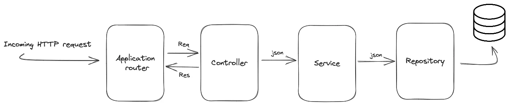

# How to Create and Update TypeORM Repository with Nest.js

A repository is always key if working with Nest.js alongside TypeORM. TypeORM is an **Object-Relational Mapping** library for TypeScript. It will create an abstraction to a database so you don’t run *raw SQL queries* but use ``TypeScript objects``.

TypeORM uses entities as the ``blueprint for your data/table attributes representation``. The data you add using POST and fetch using GET will rely on what your TypeORM entities say. This way, TypeORM will use a Repository as your entity manager.

The Repository will create methods to interact with the underlying database through your TypeORM entity. A Repository is simply used to run the TypeORM entity to perform ``CRUD (Create, Read, Update, Delete)``operations on the database. This guide will teach you everything you need to know about TypeORM Repository with Nest.js.


## How Repository Works with Nest.js and TypeORM

As described above, a TypeORM repository is an Entity Manager. This means it creates a higher-level interface for interacting with the database and provides a set of methods for CRUD.


Typically, TypeORM will use a Repository to abstract data access logic with a clean API for interacting with your related entities. That’s the only way TypeORM gets access to your database without Raw SQL queries. The reason is that the repository is the bridge between the application TypeORM code and the underlying database.

If you are working with Nest.js to run TypeORM, you will create repositories within Nest.js services files. Here, you will create details of how data is retrieved, adding new items, and deleting or updating them.

## Key Components of TypeORM Repository

For TypeORM to execute a Repository, you must have a few components in your app:


* **Entity:** The TypeScript class representing a table in the database with each instance of the class corresponding to a row in the table. TypeORM uses `@Entity()` to tell your Repository a class that relates to entities. You then use decorators like `@PrimaryGeneratedColumn`, and `@Column` to polish the structure of that entity.
* **Repository class** that extends the `Repository<Entity>` class from TypeORM. This repository class will access the Entity with for example `@EntityRepository(EntityClass)` TypeORM decorator.
* **Entity Manager** to create an instance of the `Entity Manager` class for managing entities and their lifecycle through the manager property for handling database CRUD operations.


Based on your Repository, you will create TypeORM Repository Methods such as:

* Finds and fetches data that match a condition.

```ts
find(options?: FindManyOptions): Promise<Entity[]>:
```

This example will use the repository to execute `find()` from TypeORM:

```ts
const users = await userRepository.find((options?): Promise<Entity | undefined>);
```

The same applies to finding one single entity with a given TypeORM Repository condition. Only that you will use `findOne()` from TypeORM:

```ts
const user = await userRepository.findOne((options?):: Promise<Entity | undefined>);
```

* Persist data (inserts, deletes and updates) in the database.

```ts
const savedUser = await userRepository.save(user);
update(id: string | number | Date, partialEntity: QueryDeepPartialEntity<Entity>): Promise<UpdateResult>:
```

To update your data, TypeORM will need your Repository to execute an `update()` and `delete()` to remove items from the database:

```ts
//Updates the entity using the partial entity data.
Example: const result = await userRepository.update(1, { username: 'new_username' });

//Deletes the entity
const result = await userRepository.delete(1);
```
